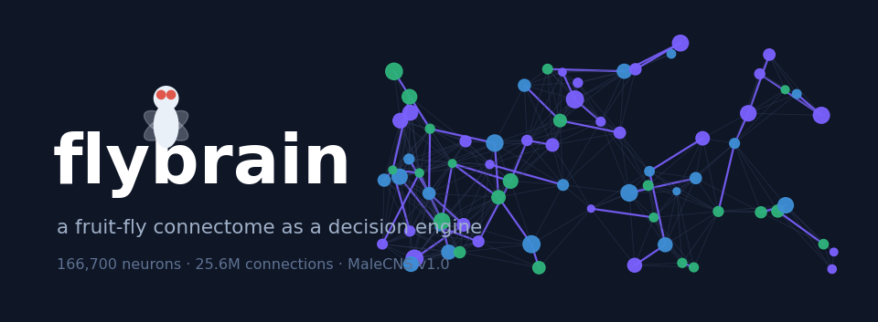
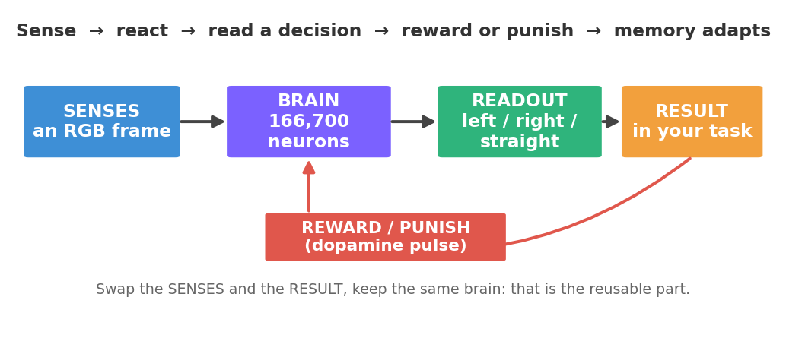

# flybrain

A wiring-constrained fruit-fly connectome used as a **reusable decision engine** — with
no trading, market or finance concepts anywhere. You feed it an image and an optional
reward/punish signal; it runs the retained **MaleCNS v1.0 graph (166,700 neurons, 25.6
million connections)** and returns a motor readout plus its memory state.

This is the neural core extracted from the *stonkfly* experiment. Everything about
exchanges, brokers, prices and orders was left behind. What remains is the brain: senses
→ spiking network → readout → reward-driven plasticity.

## How it works



Every step follows the same loop, regardless of the task:

- **Sees** — an RGB frame (`180×320×3`) stimulates 3,335 brightness photoreceptors and
  811 color (R8) cells mapped onto the connectome. The brain sees *pixels*, not numbers.
- **Thinks** — a native C++ kernel integrates leaky integrate-and-fire neurons at 0.1 ms
  of simulated time.
- **Decides** — two descending motor populations (DNp20 left/right, gated by DNpe017)
  produce a steering readout: `left`, `right` or `straight`. These are the fly's real
  turning neurons, not an invented output.
- **Learns** — a `reward` or `aversive` pulse drives identified dopamine cells, and an
  anti-Hebbian rule adjusts 7,835 existing KC→MBON memory synapses. What was active just
  before the pulse gets strengthened or weakened.

## Install

Python 3.11, a C++17 compiler (only needed if the prebuilt kernel is rebuilt),
macOS/Linux. The runtime dataset is ~260 MB (see [Data](#data-and-provenance)).

```sh
python3.11 -m venv .venv
source .venv/bin/activate
pip install -e '.[test]'
flybrain verify        # check the local dataset against committed locks
flybrain demo          # non-trading visual-stimulus demonstration
```

You can also run the demo without installing:

```sh
python examples/stimulus_demo.py
```

The demo shows a half-bright frame to the network and prints how the motor cells respond,
then delivers a dopamine pulse and reports how many memory synapses changed.

## Use it in code

```python
import numpy as np
from flybrain import load

brain = load()                                  # build from the local dataset
frame = np.zeros((180, 320, 3), np.uint8)       # your input rendered as an RGB frame
frame[:, 160:] = 255                            # e.g. bright on the right half

result = brain.observe(frame, "reward")         # "none" | "reward" | "aversive"
print(result["turn"])                           # 'left' | 'right' | 'straight'
print(result["difference_hz"], result["total_spikes"])
print(result["memory"]["changed_edges"])        # memory synapses that moved this step

brain.save("checkpoint.npz")                    # persist the learned weights
brain.restore("checkpoint.npz")
```

### What `observe` returns

| Field | Meaning |
| --- | --- |
| `turn` | `left` / `right` / `straight` — the DNp20 steering readout |
| `left_hz`, `right_hz` | mean firing rate of each DNp20 population |
| `difference_hz` | right minus left (the signed steering drive) |
| `gate_spikes` | DNpe017 gate spikes (readout is `straight` if the gate is closed) |
| `total_spikes`, `KC_spikes`, `reward_spikes`, `aversive_spikes` | spike counts per population |
| `MBON07_spikes`, `MBON11_spikes` | reward/aversive MBON output — the valence readout downstream of the plastic synapses |
| `memory` | `plastic_edges`, `changed_edges`, `mean_efficacy`, model id |
| `brain_ms`, `compute_seconds` | simulated neural time and wall time for the step |

## Applying it to other things

The reusable pattern is: **turn any input into an RGB frame → let the network react →
read a decision → optionally deliver reward/punishment so memory adapts.** Swap the
"senses" (what you render into the frame) and the "hands" (how you use the readout); keep
the same brain in the middle. It fits perception→action tasks that have a clear
success/failure signal:

- **Anomaly detection** — learn what "normal" looks like, flag departures from the pattern.
- **Simple real-time control** — react to sensors (avoid obstacles, keep balance).
- **Learned classification** — label signals (sounds, images, sensor readings) taught by
  rewarded examples.

## Does the memory actually work? — associative conditioning assay

`flybrain/conditioning.py` closes the loop the demo leaves open: it does not just show
synapses moving, it tests whether they form a *usable, associative* memory.

```sh
flybrain conditioning            # or: python examples/conditioning.py
```

Because the reconstructed visual pathway barely reaches the mushroom body (a full-white
frame fires only ~14 of 4,064 Kenyon cells; a dark one, zero), the assay drives
Kenyon-cell subsets directly — as optogenetic mushroom-body conditioning does in the real
fly — and pairs two stimuli with the identified dopamine cells (PAM11 reward → MBON07,
PPL101 aversive → MBON11). The key is a **2×2 reversal control**: it runs the experiment
once as A→reward / B→aversive and once reversed, then asks whether pairing a stimulus with
a dopamine population depresses *that stimulus's own* synapses onto the matching MBON
compartment more than the opposite pairing does. That difference cancels the background
depression that recurrent CS→dopamine recruitment produces in both compartments (a naive
"unpaired" control does not, which is why it is not used).

Result on MaleCNS v1.0 (deterministic, seed 0): **the memory is associative in both
compartments** — pairing selectively depresses the matched compartment, and reversing the
pairing reverses the effect. The reward pathway's effect is ~2× the aversive one, an
honest reflection of the circuit's asymmetry (15 PAM11 reward cells vs 2 PPL101 aversive
cells). This characterizes what the committed rule and wiring do; it is still not
validated against fly behaviour.

## Honest limits

- The connectome is a **fly's**, and fixed. Only the KC→MBON memory synapses adapt, with a
  small local rule; the readout mapping is engineered, not discovered.
- It is heavy (166,700 simulated neurons) and **not shown to beat classical methods** on
  any useful task. Treat it as a research and teaching engine, not a tuned product.
- `reward`/`aversive` are engineered signals into identified dopamine cells. No pain,
  pleasure or consciousness is modeled or claimed.

## Data and provenance

The runtime needs `data/graph.npz`, `data/annotations.feather`,
`data/normalized/neurons.feather` and the compiled kernel. Because `graph.npz` is 239 MB
(above GitHub's file limit), the `data/` directory is git-ignored. To obtain it:

- **Rebuild from sources:** `flybrain prepare` downloads the released MaleCNS files listed
  in `sources.lock.json` and recompiles the graph. `flybrain verify` then checks every
  array against the committed locks.
- **Point elsewhere:** set `FLYBRAIN_DATA=/path/to/data` to use a dataset in another
  location.

Source: [MaleCNS v1.0](https://male-cns.janelia.org/download/), downloaded under its
upstream license. The neural mechanism and provenance mirror the original stonkfly model.

## Tests

```sh
python -m pytest -q                    # fast unit tests (decoder + memory rule)
FLYBRAIN_FULL_TEST=1 python -m pytest  # also runs the full 166k-neuron integration test
```

## License

The code in this repository is released under the MIT License (see `LICENSE`). The
MaleCNS v1.0 connectome dataset it consumes is **not** covered by that license and remains
under its own upstream terms — see [Data and provenance](#data-and-provenance).
